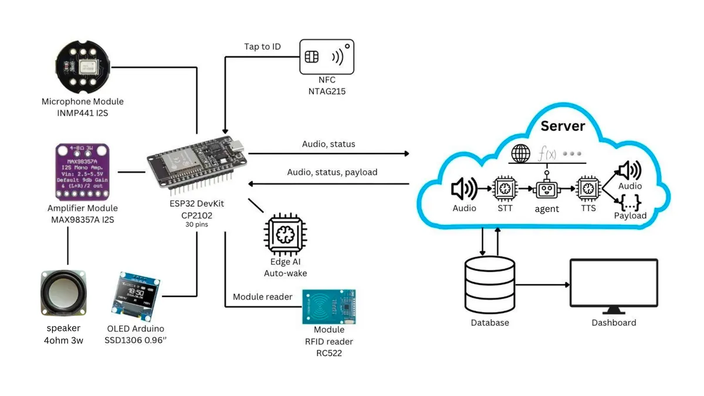
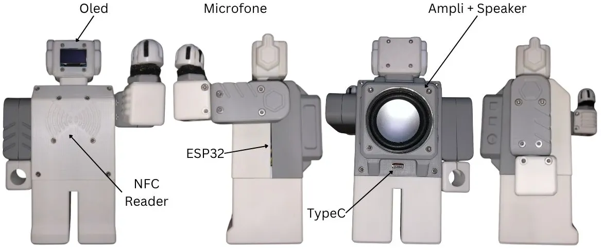

# smart-speaker

A multilingual smart speaker that understands natural language. Speak to it like a person — ask questions, chat, check gold prices or news, manage to-do lists, or play music. Personalized with NFC — your profile, lists, alarms, and preferences follow you. Wake word runs locally on the ESP32; a LangGraph AI agent handles understanding and actions.



<p align="center">
  
</p>

---

## Demo

<p align="center">
  <video src="docs/demo/demo.mp4" controls width="360"></video>
</p>

See the full UI gallery → [`docs/demo/ui/`](docs/demo/ui/) (mobile, PWA, web dashboard, board photos, and packaging).

## Features

- ⏰ **Alarms & timers** — Set, list, cancel by voice; persisted in PostgreSQL.
- 📋 **Lists** — Shopping and to-do lists, fully voice-driven.
- 🎵 **Media playback** — Search and play YouTube audio through the speaker.
- 📱 **Companion apps** — Mobile app (Expo Go) and WebUI/PWA for managing profile, lists, and history.
- ⚡ **Real-time FreeRTOS pipeline** — Audio capture, wake-word inference, networking, and UI across both ESP32 cores.

## Tech Stack

| Component | Stack |
| --- | --- |
| **Firmware** | C++ / Arduino (ESP32, PlatformIO, FreeRTOS) |
| **Voice & AI backend** | Python, Flask, LangGraph, Groq Whisper, Silero VAD, VieNeu TTS |
| **Database API** | Python, Flask, SQLAlchemy, PostgreSQL |
| **Mobile app** | Expo SDK 54, React Native, TypeScript, NativeWind |
| **WebUI / PWA** | Flask/Jinja2, HTML/CSS/JS — served at [`/dev/assistant`](http://localhost:8387/dev/assistant) |
| **Wake-word model** | Edge Impulse → TFLite Micro (ESP32, ~6 KB arena) |

Hardware wiring: [`docs/pin_mapping.md`](docs/pin_mapping.md)

## Getting Started

### Prerequisites

- Git, Python 3.10+, Node.js 20+
- PlatformIO (VS Code extension or CLI) for firmware
- Expo CLI for mobile
- PostgreSQL 14+ for the database

### 1. Clone

```bash
git clone https://github.com/your-org/smart-speaker.git
cd smart-speaker
```

### 2. Database (PostgreSQL)

Start PostgreSQL, create the role and database:

```sql
CREATE ROLE ss_project_admin WITH LOGIN PASSWORD 'admin123';
CREATE DATABASE ss_project OWNER ss_project_admin;
```

Copy environment and initialize:

```bash
cp server/database/.env.example server/database/.env
python3 -m venv .venv
source .venv/bin/activate
pip install -r server/database/requirements.txt
python3 server/database/app.py
```

Verify: `curl http://localhost:8386/health`

> See [`server/database/README.md`](server/database/README.md) for detailed setup.

### 3. Voice & AI Backend

```bash
cp server/backend/.env.example server/backend/.env
# Edit server/backend/.env — add GROQ_API_KEY, OPENROUTER_API_KEY
source .venv/bin/activate
pip install -r server/backend/requirements.txt
python3 server/backend/app.py
```

Verify: `curl http://localhost:8387/health`

> See [`server/backend/README.md`](server/backend/README.md) for endpoints and debugging.

### 4. Firmware (ESP32)

```bash
# Copy secrets template
cp include/secrets.example.h include/secrets.h
# Edit include/secrets.h with your Wi-Fi credentials
```

Open the project in **VS Code with PlatformIO extension** (or use PlatformIO CLI), then build and upload:

```bash
pio run --target upload
```

Monitor serial output:

```bash
pio device monitor --baud 115200
```

### 5. Mobile App (Expo Go)

```bash
cd mobile
npm install
npx expo start
```

Scan the QR code with **Expo Go** on your phone, or press `a` for Android / `i` for iOS simulator.

> See [`mobile/`](mobile) for available scripts (`npm run lint`, `npm run format`, etc.).

### 6. WebUI / PWA

Once the voice backend is running, open the assistant lab in your browser:

<p>
  <a href="http://localhost:8387/dev/assistant" target="_blank">
    🔗 http://localhost:8387/dev/assistant
  </a>
</p>

The WebUI supports:
- **Text turns** — Type a command and see the assistant's full response with tool calls.
- **Voice turns** — Record from browser mic or upload an audio file; the backend runs STT → agent → TTS.
- **Session controls** — Set user/NFC/device identity, reset sessions, inspect active sessions.
- **ESP capture controls** — Start/stop WebSocket audio capture, monitor capture status.
- **Playback** — Listen to TTS audio and media streams generated by the backend.

The Expo app can also be served as a PWA:

```bash
cd mobile
npx expo start --web
```

## Configuration

### Firmware (`include/secrets.h`)

| Define | Description |
| --- | --- |
| `WIFI_STA_SSID` / `WIFI_STA_PASSWORD` | Wi-Fi credentials |
| `SERVER_URL` | Public base URL for NFC registration page |
| `DEVICE_API_URL` | Local database API endpoint (plain HTTP) |
| `DEVICE_VOICE_BACKEND_URL` | Local voice backend endpoint |

### Backend (`server/backend/.env`)

| Variable | Description |
| --- | --- |
| `BACKEND_API_URL` | Database service URL (default `http://localhost:8386`) |
| `GROQ_API_KEY` | Groq key for Whisper STT |
| `OPENROUTER_API_KEY` | OpenRouter key for LLM orchestration |
| `VOICE_BACKEND_PORT` | HTTP port (default `8387`) |
| `YT_DLP_BIN` | Path to `yt-dlp` for media search |
| `FFMPEG_BIN` | Path to `ffmpeg` for WAV transcoding |

### Database (`server/database/.env`)

| Variable | Description |
| --- | --- |
| `DATABASE_URL` | PostgreSQL connection string |

## Deployment

The database API is production-ready with **Gunicorn**:

```bash
cd server/database
gunicorn --config gunicorn.conf.py app:app
```

Includes a [`Procfile`](server/database/Procfile) for platform deployment (Heroku, Render, Railway, etc.).

For the voice backend, deploy `server/backend/app.py` as a web process with a production WSGI server (Gunicorn or uWSGI).

> **Note:** Keep the database API and PostgreSQL in the same region. Disable idle sleep / scale-to-zero. Point health checks at `/health`.

## Architecture Overview

Audio capture and wake-word inference run on one ESP32 core; networking, UI, and NFC handle the other. The voice backend receives audio via WebSocket, runs VAD → STT → LangGraph agent → TTS, and streams the reply back. A PostgreSQL API stores profiles, schedules, and history. Companion apps (mobile + WebUI) access the same data layer.

Detailed docs:
- [FreeRTOS task layout & data flow](docs/rtos_architecture.md)
- [Hardware wiring](docs/pin_mapping.md)
- [AI-generated diagrams](docs/ai-gen-diagrams/)

## Docs

| Resource | Description |
| --- | --- |
| [`docs/ai-gen-diagrams/`](docs/ai-gen-diagrams) | Architecture and flow diagrams |
| [`docs/pin_mapping.md`](docs/pin_mapping.md) | Complete hardware wiring reference |
| [`docs/rtos_architecture.md`](docs/rtos_architecture.md) | FreeRTOS task layout and data flow |
| [`server/backend/README.md`](server/backend/README.md) | Backend API endpoints and debugging |
| [`server/database/README.md`](server/database/README.md) | Database setup, schema, and production deploy |
| [`data/README.md`](data/README.md) | Wake-word dataset and training pipeline |

## License

[MIT](LICENSE) © 2026 Hyperformance Labs.
